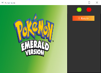
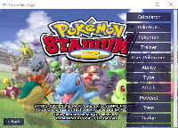
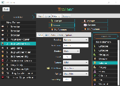
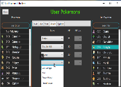
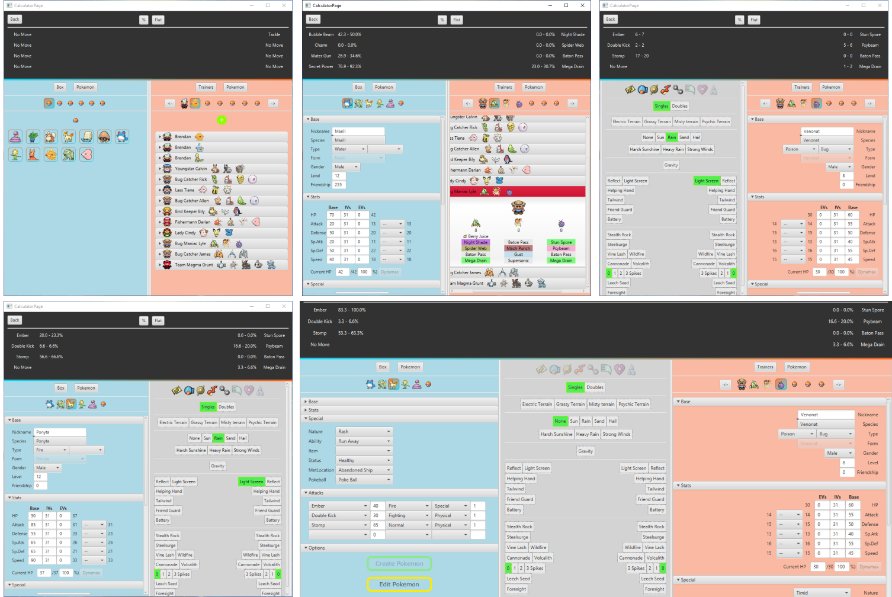
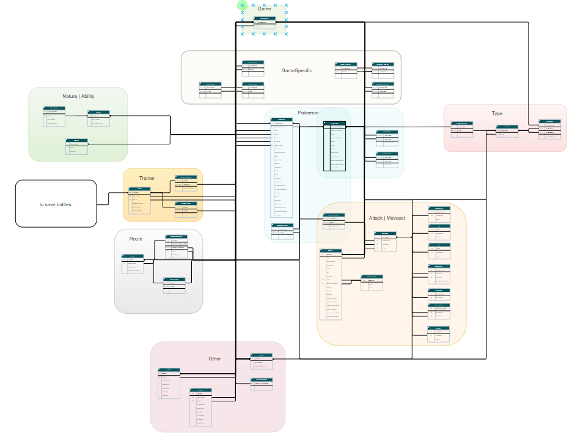

# PokeCalc

Final project of the coding course of [Coders.bay](https://www.codersbay.at/de).

## ⚙️ Techologies

The technologies used in this project:

- **[Java](https://www.java.com/en/):** Java is a high-level, class-based, object-oriented programming language that is designed to have as few implementation dependencies as possible.
- **[JavaFX](https://openjfx.io/):** The JavaFX language makes intensive use of the Java2D Swing GUI components and allows for easy creation of graphical user interfaces or GUIs.
- **[Scene Builder](https://gluonhq.com/products/scene-builder/):** JavaFX Scene Builder is a visual layout tool that lets users quickly design JavaFX application user interfaces, without coding.
- **[Apache Derby](https://db.apache.org/derby/):** Apache Derby is a relational database management system developed by the Apache Software Foundation that can be embedded in Java programs. Perfect for shipping without having the enduser to install a database.
- **[Apache Maven](https://maven.apache.org/):** Apache Maven is a software project management and comprehension tool. Based on the concept of a project object model (POM), Maven can manage a project's build, reporting and documentation from a central piece of information.
- **[SQuirreL SQL Client](http://squirrel-sql.sourceforge.net/):** The SQuirreL SQL Client is a database administration tool. It uses JDBC to allow users to explore and interact with databases via a JDBC driver. It provides an editor that offers code completion and syntax highlighting for standard SQL.

## 📸 Pictures

| Startpage                                        | Menu                                   | Trainer                                      | UserPokemon                                           |
| ------------------------------------------------ | -------------------------------------- | -------------------------------------------- | ----------------------------------------------------- |
|  |  |  |  |

### Calculator

### Entity–relationship model

